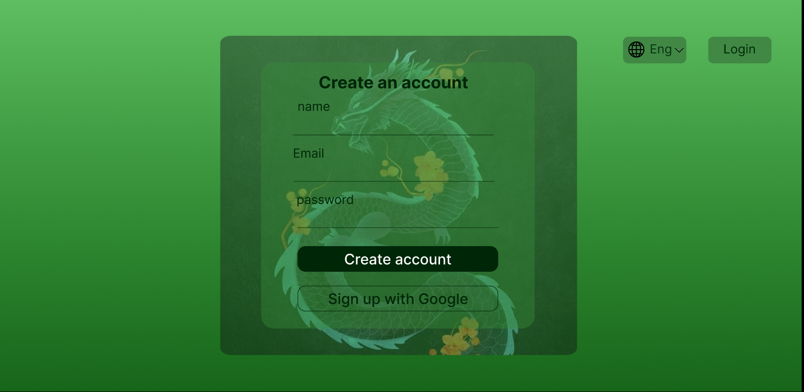
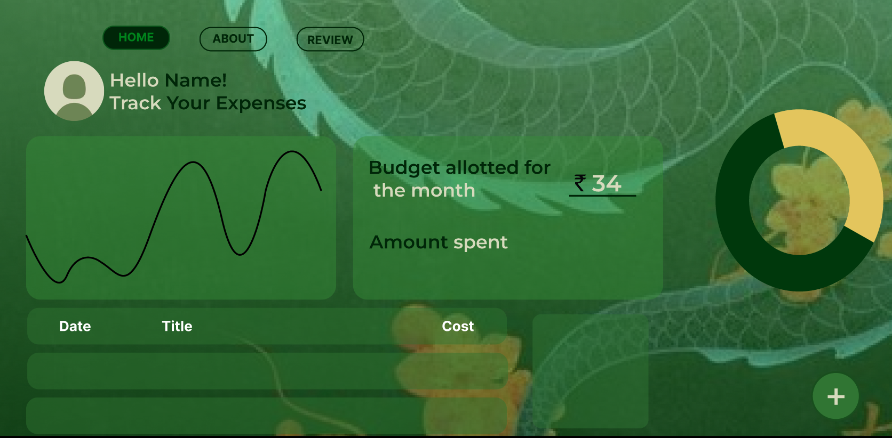

# 💰 Expensify - Smart Expense Tracker  

Expensify is a **simple and intuitive expense tracker** that helps you **manage your finances**, **set monthly budgets**, and **visualize your spending trends**! 📊  

## 🏗️ Features  

✅ **User Authentication** (Login & Register) 🔐  
✅ **Add & Categorize Expenses** 📝  
✅ **Set Monthly Budgets & Get Alerts** ⚠️  
✅ **Real-time Spending Visualization** 📊  
✅ **Track Budget Allocation vs Actual Spending** 💰  
✅ **User-Friendly Dashboard** with Interactive Charts 📈  

## 🎬 Demo Screenshots  

  






## 🚀 Tech Stack  

| Technology  | Description |
|-------------|------------|
| **Next.js** ⚛️ | Frontend framework for a seamless UI |
| **CSS** 🎨 | For modern and responsive design |
| **Chart.js** 📊 | For data visualization of spending patterns |

## 🛠️ Installation & Setup  

1️⃣ **Clone the repository**  
   ```bash
   git clone https://github.com/yourusername/expensify.git
   cd expensify
   ```

2️⃣ **Install dependencies**  
   ```bash
   npm install
   ```

3️⃣ **Run the development server**  
   ```bash
   npm run dev
   ```

## 📌 How It Works?  

1️⃣ **Register/Login to your account** 🔐  
2️⃣ **Add daily expenses with categories** 📝  
3️⃣ **Set a monthly budget & track usage** 💰  
4️⃣ **Get alerts when you exceed limits** ⚠️  
5️⃣ **Visualize spending trends with charts** 📊  

## 📬 Contact  

Have feedback or want to contribute?  
📧 Email: [mohithn2004@gmail.com](mailto:mohithn2004@gmail.com)  
🔗 Portfolio: [Mohith N](https://mohithnportfolio.netlify.app/)  

---

Made with ❤️ by **Mohith N** 🚀  
